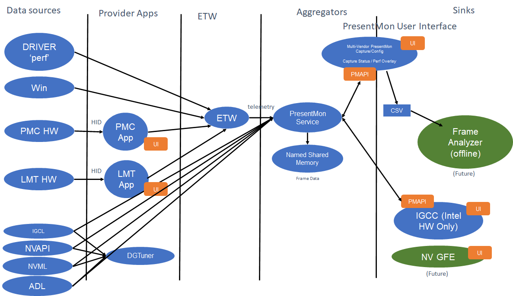
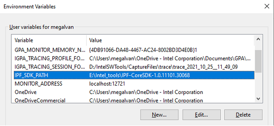

# PresentMon Service

## Overview

PresentMon Service is based off of the official [PresentData](https://github.com/GameTechDev/PresentMon) library. 
It acts as an aggregator service that provides an API for multiple clients to consume shared [ETW](https://msdn.microsoft.com/en-us/library/windows/desktop/bb968803%28v=vs.85%29.aspx?f=255&MSPPError=-2147217396) data.

The PresentMonService solution builds three applications. The first is the PresentMon service, the second is the PresentMon Capture Application and the third is the PresentMon CLI. This readme focuses on the the PresentMon service.
There are two additional readme files [PresentMon Capture Application](#presentmon-capture-application) and [PresentMon CLI](#presentmon-cli) that cover those applications in greater detail.

## License

Copyright (C) 2017-2023 Intel Corporation

Permission is hereby granted, free of charge, to any person obtaining a copy of this software and associated documentation files (the "Software"), to deal in the Software without restriction, including without limitation the rights to use, copy, modify, merge, publish, distribute, sublicense, and/or sell copies of the Software, and to permit persons to whom the Software is furnished to do so, subject to the following conditions:

The above copyright notice and this permission notice shall be included in all copies or substantial portions of the Software.

THE SOFTWARE IS PROVIDED "AS IS", WITHOUT WARRANTY OF ANY KIND, EXPRESS OR IMPLIED, INCLUDING BUT NOT LIMITED TO THE WARRANTIES OF MERCHANTABILITY, FITNESS FOR A PARTICULAR PURPOSE AND NONINFRINGEMENT.  IN NO EVENT SHALL THE AUTHORS OR COPYRIGHT HOLDERS BE LIABLE FOR ANY CLAIM, DAMAGES OR OTHER LIABILITY, WHETHER IN AN ACTION OF CONTRACT, TORT OR OTHERWISE, ARISING FROM, OUT OF OR IN CONNECTION WITH THE SOFTWARE OR THE USE OR OTHER DEALINGS IN THE SOFTWARE.

## Architecture

 


 

## Building

### PresentMon Service Prerequisites
#### WiX Installer
To build the .msi installer package, v3 of the WiX toolset and VS extension need to be present in the build environment. Installer links can be found here: [WiX Downloads](https://wixtoolset.org/docs/wix3/)
#### vcpkg Dependencies
PresentMon Service uses the C++ package manager vcpkg for third-party dependencies.
#### Install vcpkg
Vcpkg comes pre-installed by default with newer installations of Visual Studio. Note that the command `vcpkg integrate install` must be run manually as administrator from *Developer Command Prompt for Visual Studio* or *Developer PowerShell for Visual Studio* (See: https://devblogs.microsoft.com/cppblog/vcpkg-is-now-included-with-visual-studio/).

Alternatively, a stand-alone installation of vcpkg can be used. To install, navigate to the directory you want to host vcpkg from (eg. C:\vcpkg\), and run the following commands:
```powershell
git clone https://github.com/Microsoft/vcpkg.git
cd vcpkg
.\bootstrap-vcpkg.bat
.\vcpkg.exe integrate install
```
#### Package Installation
Packages are installed automatically via vcpkg manifest files.
#### Internal Intel Builds - ONLY
Internal PresentMon Service builds require ipfcorelib.lib to build. This file can be found inside the Core SDK zip file here: [IPF Release](https://wiki.ith.intel.com/display/ITSIPF/IPF+Releases). Choose a recent verson of the SDK and install on the development machine. Next set a Windows environment variable named "IPF_SDK_PATH" to the location of where the SDK was installed.



#### PresentMon Capture Application Prerequisites
In addition to the prerequisites above the PresentMon Capture application has additional items. These can be found here:
[PresentMon Capture Application Prerequisites](pc-readme.md#Prerequisites)

## Manual PresentMon Service Installation Steps
Start `Powershell` in Administrator Mode
1. Create Service:
```powershell
sc.exe create PresentMonService binPath=<Service build path> (eg: "D:\Source\applications.graphics.presentmonservice\x64\Debug\PresentMonService.exe")
```
2. Start Service
- Tap windows key, type services, launch services app
- Find PresentMonService, right click and start

3. Delete Service from registry
```powershell
.\sc.exe delete PresentMonService
```

## PresentMon Service Clients

The PresentMon Capture Application and the PresentMon CLI are two client applications that attach to the PresentMon Service and use the middleware API to report frame statistics.
### PresentMon Capture Application

The PresentMon Capture Application is both an offline trace capture and realtime performance overlay for games and other graphics-intensive applications. See link below for details.

[PresentMon Capture Readme](pc-readme.md)

### PresentMon CLI

The PresentMon CLI uses the PresentMon Service to report out frame metrics and sampled CPU/GPU telemetry. See link below for details.

[PresentMon CLI Readme](pmcli-readme.md)

## PMAnalyzer
Start `cmd`
set PATH=%PATH%;<Qt Path> (eg. set PATH=%PATH%;D:\Qt\6.3.0\msvc2019_64\bin)
