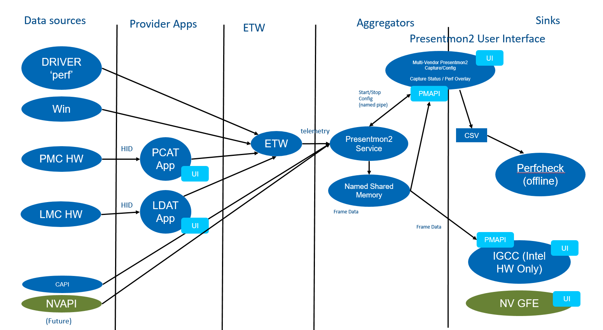

# applications.graphics.presentmonservice

# Overview

PresentMonService is base off of the official [PresentMon](https://github.com/GameTechDev/PresentMon) tool. 
It acts as an aggregator service that provides APIs for multiple client to consume shared [ETW](https://msdn.microsoft.com/en-us/library/windows/desktop/bb968803%28v=vs.85%29.aspx?f=255&MSPPError=-2147217396) data. 

## Architecture

 


 

# Build Steps
## WiX Installer
To build the .msi installer package, the WiX toolset and VS extension need to be present in the build environment. Installer links can be found here: [WiX Downloads](https://wixtoolset.org/releases/)
## vcpkg Dependencies
PresentMon 2 uses the C++ package manager vcpkg for third-party dependencies.
### Install vcpkg
Navigate to your source directory (eg. C:\Source\)
```powershell
git clone https://github.com/Microsoft/vcpkg.git
cd vcpkg
.\bootstrap-vcpkg.bat
.\vcpkg.exe integrate install
```
### Install Packages for Release
```powershell
git clone https://github.com/Microsoft/vcpkg.git
.\vcpkg.exe install glog --triplet=x64-windows-static
.\vcpkg.exe install glog --triplet=x86-windows-static
```
### Install Additional Packages for Debug
```powershell
git clone https://github.com/Microsoft/vcpkg.git
.\vcpkg.exe install glog --triplet=x64-windows
.\vcpkg.exe install glog --triplet=x86-windows
```
## Internal Intel Builds - ONLY
Internal PresentMon2 builds require ipfcorelib.lib to build. This file can be found inside the Core SDK zip file here: [IPF Release](https://wiki.ith.intel.com/display/ITSIPF/IPF+Releases). Choose a recent verson of the SDK and install on the development machine. Next set a Windows environment variable named "IPF_SDK_PATH" to the location of where the SDK was installed.


## Run Steps
### PresentMonService
Start `Powershell` in Administrator Mode
1. Create Service:
```powershell
sc.exe create PresentMonService binPath=<Service build path> (eg: "D:\Source\applications.graphics.presentmonservice\x64\Debug\PresentMonService.exe")
```
2. Start Service
- Tap windows key, type services, launch services app
- Find PresentMonService, right click and start

3. Delete Service from registry
```powershell
.\sc.exe delete PresentMonService
```

### PM2Analyzer
Start `cmd`
set PATH=%PATH%;<Qt Path> (eg. set PATH=%PATH%;D:\Qt\6.3.0\msvc2019_64\bin)


## Ref
- [Named Pipe](https://docs.microsoft.com/en-us/windows/win32/ipc/named-pipes) for inter process communication 

## PresentMon 2 Capture Application

The PresentMon 2 Capture Application is both an offline trace capture and realtime performance overlay for games and other graphics-intensive applications. See link below for details.

[PresentMon 2 Capture Readme](p2c-readme.md)
